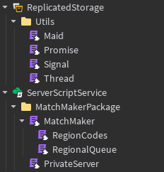

# 

# What is MatchMaker ?

MatchMaker is a custom matchmaking system designed for Roblox experiences that need flexibility, reliability, and real-time coordination. It leverages Promises for clean, asynchronous flows and uses MemoryStore to share data instantly across servers—making it ideal for multiplayer games with party-based queues, regional distribution, and private server transitions. This tool focuses on predictability and scalability without relying on third-party services or polling workarounds.

**Key Features:**
* **Region-Based Queues:** Players are grouped by their geographic region for optimal latency and fairness.
* **Promise-Driven Asynchrony:** All operations are non-blocking and structured using robust promise chains.
* **Auto-Match Coordination:** One server becomes a **match coordinator** and is responsible for generating matches based on customizable logic.
* **Private Server Integration:** Matches are hosted on dynamically reserved private servers with persistent metadata and lifecycle tracking.
* **Graceful Error Handling:** Errors are propagated and isolated cleanly, avoiding unwanted chain continuation.
* **Custom Matchmaking Logic:** Plug in your own logic to define how players are grouped into matches.

# Installation

Make sure your game includes the following folders:

- **`ReplicatedStorage/Utils`**  
  This folder should contain the required utility modules (`Promise`, `Signal`, etc.).

- **`ServerScriptService/MatchMakerPackage`**  
  This should include the MatchMaker module files (`MatchMaker`, `RegionalQueue`, `PrivateServer`, etc.).

    

> You can organize and customize submodules as needed, but these are required for the system to initialize and run properly.

You can test the MatchMaker system right away using this copy unlocked [**Template Place**](https://www.roblox.com/games/131765851319441/MatchMaker-Template-Place)